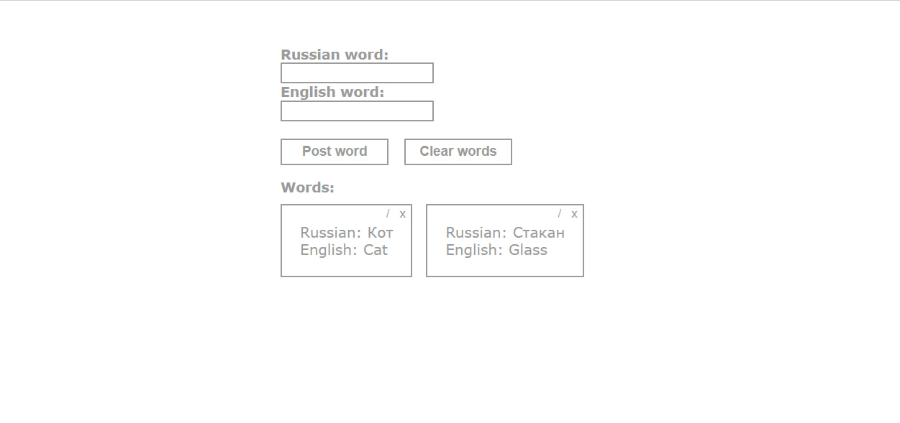

# Web-Dictionary

## Introduction
This project is a simple dictionary that makes it possible to manage a list of words. It includes functions such as adding, editing, deleting words, as well as clearing the list. 
The project implements a client-server architecture. A client is an html page managed using Javascript. The server is written in Go, it uses the REST API, and the storage for words is an SQLite database.

## Overview


## Technologies, Patterns were used in this project
* [REST API](https://go.dev/doc/tutorial/web-service-gin)
* [SQLite](https://pkg.go.dev/github.com/mattn/go-sqlite3)
* [Go](https://go.dev/)
* [JavaScript](https://javascript.info/)
  
## Requirement
These requirements must be met before you begin:
Before you start, if your Go version less than 1.20.2, it recomended to install it by following this link [Go](https://go.dev/dl/)

## Getting Started
## Downloading server
First you have to download the server by this link - [server](https://github.com/sqworec/rest-server)

Then in server directory type in terminal: ```go get```

Finally type in terminal: ```go run main.go```

Since this moment server is working

## Main functions of the messenger:
* Adding words
* Clearing the list of words
* Removing selected word
* Editing selected word
