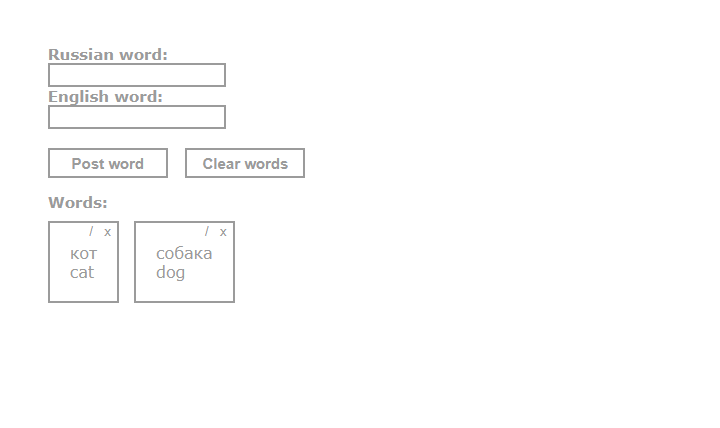

# Web-Dictionary

## Introduction
This project is a simple dictionary that allows you to manage a list of words. In this project, the separation of business logic (Dependency Injection) was implemented. It includes functions such as adding, editing, deleting words, as well as clearing the list. 
The client-server architecture is implemented in the project. A client is an html page managed using Javascript. The server is written in Go, it uses the REST API, and the storage for words is the SQLite database.

## Overview


## Main functions of the dictionary:
* Adding words;
* Clearing the list of words;
* Removing selected word;
* Editing selected word.

## Technologies, Patterns were used in this project
* [REST API](https://go.dev/doc/tutorial/web-service-gin)
* [SQLite](https://pkg.go.dev/github.com/mattn/go-sqlite3)
* [Go](https://go.dev/)
* [JavaScript](https://javascript.info/)
* [Dependency Injection](https://medium.com/avenue-tech/dependency-injection-in-go-35293ef7b6)
  
## Requirement
These requirements must be met before you begin:

Before you start, if you Go version less than 1.20.2, it recommended to install it by following this link — [Go](https://go.dev/dl/).

## Getting Started
#### Downloading server
First you have to download the server by this link — [server](https://github.com/sqworec/rest-server).

Then in server directory type in terminal: 
```
1. go get
2. go build .
3. go run ./
```
Since this moment server is working.
